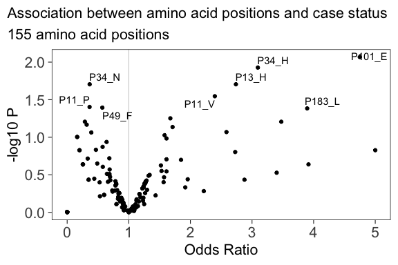
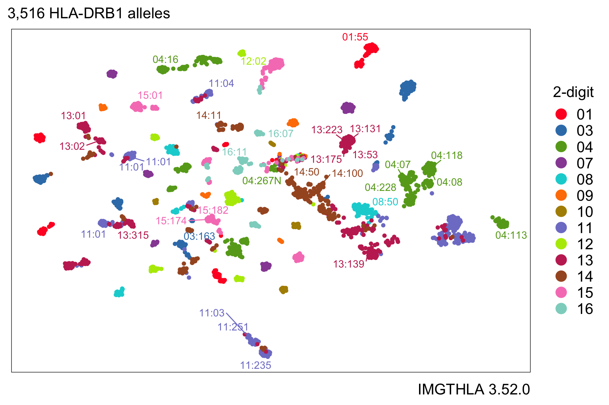

# hlabud </img>

[](https://github.com/slowkow/hlabud/actions/workflows/R-CMD-check.yaml)

hlabud provides methods to retrieve sequence alignment data from
[IMGTHLA](https://github.com/ANHIG/IMGTHLA) and convert the data into
convenient R matrices ready for downstream analysis. The
[vignette](vignettes/examples.md) shows examples of how to use the data
with logistic regression and dimensionality reduction.

For example, let’s consider a simple question about two HLA genotypes
DRB1\*04:174 and DRB1\*15:152. What amino acid positions are different
between these two genotypes?

``` r
library(hlabud)
a <- hla_alignments("DRB1")
dosage(c("DRB1*04:174", "DRB1*15:152"), a$onehot)
```

    ##             pos9_E pos9_W
    ## DRB1*04:174      1      0
    ## DRB1*15:152      0      1

From this output, we can see that the two genotypes are nearly
identical, but they differ at position 9:

-   position 9 E (Glu) in DRB1\*04:174
-   position 9 W (Trp) in DRB1\*15:152

It is just as easy to find the exonic nucleotides that distinguish the
two alleles:

``` r
n <- hla_alignments("DRB1", type = "nuc")
dosage(c("DRB1*04:174", "DRB1*15:152"), n$onehot)
```

    ##             pos109_C pos109_T
    ## DRB1*04:174        0        1
    ## DRB1*15:152        1        0

-   position 109 T in DRB1\*04:174
-   position 109 C in DRB1\*15:152

# Installation

The quickest way to get hlabud is to install from GitHub:

``` r
# install.packages("devtools")
devtools::install_github("slowkow/hlabud")
```

# Examples

See the [usage examples](vignettes/examples.md) to get some ideas for
how to use hlabud in your analyses.

-   [Get a one-hot encoded matrix for all HLA-DRB1
    alleles](https://github.com/slowkow/hlabud/blob/main/vignettes/examples.md#get-a-one-hot-encoded-matrix-for-all-hla-drb1-alleles)
-   [Convert genotypes to a dosage
    matrix](https://github.com/slowkow/hlabud/blob/main/vignettes/examples.md#convert-genotypes-to-a-dosage-matrix)
-   [Logistic regression association for amino acid
    positions](https://github.com/slowkow/hlabud/blob/main/vignettes/examples.md#logistic-regression-association-for-amino-acid-positions)
-   [UMAP embedding of 3,516 HLA-DRB1
    alleles](https://github.com/slowkow/hlabud/blob/main/vignettes/examples.md#umap-embedding-of-3516-hla-drb1-alleles)
-   [Download and unpack all data from the latest IMGTHLA
    release](https://github.com/slowkow/hlabud/blob/main/vignettes/examples.md#download-and-unpack-all-data-from-the-latest-imgthla-release)

<a href="vignettes/examples.md#logistic-regression-association-for-amino-acid-positions">

</a>
<a href="vignettes/examples.md#umap-embedding-of-3516-hla-drb1-alleles">

</a>

# Citation

`hlabud` provides access to the data in IMGT/HLA database. Therefore, if
you use `hlabud` then please cite the IMGT/HLA paper:

-   Robinson J, Barker DJ, Georgiou X, Cooper MA, Flicek P, Marsh SGE.
    [IPD-IMGT/HLA
    Database.](https://www.ncbi.nlm.nih.gov/pubmed/31667505) Nucleic
    Acids Res. 2020;48: D948–D955. <doi:10.1093/nar/gkz950>

`hlabud` also provides access to the data in Allele Frequency Net
Database (AFND). Therefore, if you use `hlabud::hla_frequencies()` then
please cite the AFND paper:

-   Gonzalez-Galarza FF, McCabe A, Santos EJMD, Jones J, Takeshita L,
    Ortega-Rivera ND, et al. [Allele frequency net database (AFND) 2020
    update: gold-standard data classification, open access genotype data
    and new query tools.](https://pubmed.ncbi.nlm.nih.gov/31722398)
    Nucleic Acids Res. 2020;48: D783–D788. <doi:10.1093/nar/gkz1029>

Additionally, you can also cite the `hlabud` package like this:

-   Slowikowski K. hlabud: methods for access and analysis of the human
    leukocyte antigen (HLA) gene sequence alignments from IMGT/HLA. R
    package version 1.0.0.

# Related work

I recommend this article for anyone new to HLA, because the beautiful
figures help to build intuition:

-   La Gruta NL, Gras S, Daley SR, Thomas PG, Rossjohn J. [Understanding
    the drivers of MHC restriction of T cell
    receptors.](https://www.ncbi.nlm.nih.gov/pubmed/29636542) Nat Rev
    Immunol. 2018;18: 467–478.

Learn about the conventions for HLA nomenclature:

-   Marsh SGE, Albert ED, Bodmer WF, Bontrop RE, Dupont B, Erlich HA, et
    al. [Nomenclature for factors of the HLA system,
    2010.](https://www.ncbi.nlm.nih.gov/pubmed/20356336) Tissue
    Antigens. 2010;75: 291–455.

For case-control analysis of HLA genotype data, consider the
[BIGDAWG](https://CRAN.R-project.org/package=BIGDAWG) R package
available on CRAN. Here is the related article:

-   Pappas DJ, Marin W, Hollenbach JA, Mack SJ. [Bridging ImmunoGenomic
    Data Analysis Workflow Gaps (BIGDAWG): An integrated case-control
    analysis pipeline.](https://pubmed.ncbi.nlm.nih.gov/26708359) Hum
    Immunol. 2016;77: 283–287.
