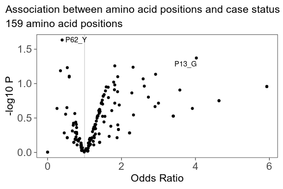

-   [Introduction](#introduction)
-   [Installation](#installation)
-   [Examples](#examples)
    -   [Get a one-hot encoded matrix for all HLA-DRB1
        alleles](#get-a-one-hot-encoded-matrix-for-all-hla-drb1-alleles)
    -   [Logistic regression association testing for each amino acid
        position](#logistic-regression-association-testing-for-each-amino-acid-position)
    -   [UMAP embedding of 3,486 HLA-DRB1
        alleles](#umap-embedding-of-3486-hla-drb1-alleles)
    -   [Download and unpack the latest release from
        IMGTHLA](#download-and-unpack-the-latest-release-from-imgthla)
-   [Related work](#related-work)

Introduction
============

hlabud is an R package that provides functions to download and analyze
human leukocyte antigen (HLA) genotypes from
[IMGTHLA](https://github.com/ANHIG/IMGTHLA) in a tidy R workflow.

Installation
============

The quickest way to get hlabud is to install from GitHub:

``` r
# install.packages("devtools")
devtools::install_github("slowkow/hlabud")
```

Examples
========

Here are a few examples that demonstrate how to use hlabud in an
analysis.

Get a one-hot encoded matrix for all HLA-DRB1 alleles
-----------------------------------------------------

We can use `hla_alignments("DRB1")` to load the `DRB1_prot.txt` file
from the latest IMGTHLA release:

``` r
library(hlabud)
a <- hla_alignments(gene = "DRB1", quiet = FALSE)
```

    ## hlabud is using IMGTHLA release 3.51.0

    ## Reading /projects/home/ks38/.local/share/hlabud/3.51.0/alignments/DRB1_prot.txt

The amino acid sequence alignments are in a data frame:

``` r
a$sequences[1:5,]
```

    ## # A tibble: 5 × 2
    ##   allele           seq                                                                              
    ##   <chr>            <chr>                                                                            
    ## 1 DRB1*01:01:01:01 MVCLKLPGGSCMTALTVTLMVLSSPLALAGDTRPRFLWQLKFECHFFNGTERVR.LLERCIYNQEE.SVRFDSDVGEYRA…
    ## 2 DRB1*01:01:01:02 ------------------------------------------------------.-----------.-------------…
    ## 3 DRB1*01:01:01:03 ------------------------------------------------------.-----------.-------------…
    ## 4 DRB1*01:01:01:04 ------------------------------------------------------.-----------.-------------…
    ## 5 DRB1*01:01:01:05 ------------------------------------------------------.-----------.-------------…

And we get a one-hot encoded matrix with one column for each amino acid
at each position:

``` r
a$onehot[1:5,1:5]
```

    ##                  Pn29_M Pn28_V Pn27_C Pn26_L Pn25_K
    ## DRB1*01:01:01:01      1      1      1      1      1
    ## DRB1*01:01:01:02      1      1      1      1      1
    ## DRB1*01:01:01:03      1      1      1      1      1
    ## DRB1*01:01:01:04      1      1      1      1      1
    ## DRB1*01:01:01:05      1      1      1      1      1

Now, suppose we have some individuals with the following genotypes:

``` r
genotypes <- c(
  "DRB1*12:02:02:03+DRB1*12:02:02:03+DRB1*14:54:02",
  "DRB1*04:174+DRB1*15:152",
  "DRB1*04:56:02+DRB1*15:01:48",
  "DRB1*14:172+DRB1*04:160",
  "DRB1*04:359+DRB1*04:284:02"
)
```

Suppose we want to run an association test on the amino acid positions.

We can use `amino_dosage()` to convert each individual’s genotypes to
amino acid dosages:

``` r
dosage <- amino_dosage(genotypes, a$onehot)
dosage[,1:10]
```

    ##                                                 Pn29_M P6_R P9_E P9_W P10_Q P10_Y P11_V P13_H P13_P
    ## DRB1*12:02:02:03+DRB1*12:02:02:03+DRB1*14:54:02      2    3    3    0     0     3     0     0     0
    ## DRB1*04:174+DRB1*15:152                              0    2    1    1     2     0     1     1     0
    ## DRB1*04:56:02+DRB1*15:01:48                          0    2    1    1     2     0     1     1     0
    ## DRB1*14:172+DRB1*04:160                              0    2    2    0     1     1     1     0     1
    ## DRB1*04:359+DRB1*04:284:02                           0    2    2    0     2     0     2     2     0
    ##                                                 P13_S
    ## DRB1*12:02:02:03+DRB1*12:02:02:03+DRB1*14:54:02     1
    ## DRB1*04:174+DRB1*15:152                             0
    ## DRB1*04:56:02+DRB1*15:01:48                         0
    ## DRB1*14:172+DRB1*04:160                             1
    ## DRB1*04:359+DRB1*04:284:02                          0

``` r
dim(dosage)
```

    ## [1]  5 35

**Note:**

-   The `dosage` matrix has one row for each individual and one column
    for each amino acid at each position. By default, `amino_dosage()`
    will discard the columns where all individuals are identical.

-   The first individual has `dosage=3` for `P6_R` (position 6 Arg).
    That’s because we assigned this individual 3 alleles in our input.

Please be careful to check that your data looks the way you expect!

Logistic regression association testing for each amino acid position
--------------------------------------------------------------------

Let’s simulate a dataset:

``` r
set.seed(2)
n <- 100
d <- data.frame(
  geno = paste(
    sample(rownames(a$onehot), n, replace = TRUE),
    sample(rownames(a$onehot), n, replace = TRUE),
    sep = "+"
  ),
  age = sample(21:100, n, replace = TRUE),
  case = sample(0:1, n, replace = TRUE)
)
d <- cbind(d, amino_dosage(d$geno, a$onehot))
d[1:5,1:10]
```

    ##                                                geno age case Pn29_M Pn25_K Pn25_R Pn24_F Pn24_L
    ## DRB1*04:271+DRB1*01:02:12 DRB1*04:271+DRB1*01:02:12  72    0      0      0      0      0      0
    ## DRB1*04:19+DRB1*15:07:01   DRB1*04:19+DRB1*15:07:01  22    1      2      2      0      1      1
    ## DRB1*14:54:08+DRB1*04:292 DRB1*14:54:08+DRB1*04:292  34    0      0      0      0      0      0
    ## DRB1*03:98+DRB1*03:108       DRB1*03:98+DRB1*03:108  76    0      0      0      0      0      0
    ## DRB1*03:74+DRB1*13:71         DRB1*03:74+DRB1*13:71  96    1      0      0      0      0      0
    ##                           Pn17_A Pn17_T
    ## DRB1*04:271+DRB1*01:02:12      0      0
    ## DRB1*04:19+DRB1*15:07:01       1      1
    ## DRB1*14:54:08+DRB1*04:292      0      0
    ## DRB1*03:98+DRB1*03:108         0      0
    ## DRB1*03:74+DRB1*13:71          0      0

Now, we can use `glm()` to fit a logistic regression model for each
amino acid position. This could reveal if any amino acid position might
be associated with the `case` variable in our simulated dataset.

``` r
# select the amino acid positions that have at least 3 people with dosage > 0
my_as <- names(which(colSums(d[,4:ncol(d)] > 0) >= 3))

# run the association tests
my_glm <- rbindlist(pblapply(my_as, function(my_a) {
  f <- sprintf("case ~ %s", my_a)
  glm(as.formula(f), data = d, family = "binomial") %>%
    parameters(exponentiate = TRUE)
}))

# look at the top hits
my_glm %>%
  arrange(p) %>%
  filter(!Parameter %in% c("(Intercept)")) %>%
  head
```

    ##    Parameter Coefficient        SE   CI    CI_low    CI_high         z df_error          p
    ## 1:     P62_Y   0.3941101 0.1616955 0.95 0.1689189  0.8533865 -2.269486      Inf 0.02323880
    ## 2:     P13_G   4.0243902 2.7614898 0.95 1.1612170 18.7172101  2.029142      Inf 0.04244386
    ## 3:     P49_Y   1.8181911 0.5670185 0.95 0.9999588  3.4287965  1.917030      Inf 0.05523418
    ## 4:     P72_R   2.3127447 1.0221532 0.95 1.0163649  5.8789932  1.897060      Inf 0.05782000
    ## 5:     P76_A   0.5331945 0.1773077 0.95 0.2713305  1.0083553 -1.891117      Inf 0.05860878
    ## 6:     P16_H   0.3488372 0.1991184 0.95 0.1040766  1.0169353 -1.845022      Inf 0.06503428

The volcano below shows the Odds Ratio and P-value for each amino acid
position. The top hits with P &lt; 0.05 are labeled.



UMAP embedding of 3,486 HLA-DRB1 alleles
----------------------------------------

Here is a UMAP embedding of 3,486 HLA-DRB1 alleles encoded as a one-hot
amino acid matrix with 1404 columns, one for each amino acid at each
position.

``` r
uamp(a$onehot, n_epochs = 200, min_dist = 1, spread = 2)
```


We can highlight which alleles have amino acid H at position 13:


Download and unpack the latest release from IMGTHLA
---------------------------------------------------

Run `install_hla()` to download and unpack the [latest IMGTHLA
release](https://github.com/ANHIG/IMGTHLA/releases).

Download the latest release (default) or a specific release:

``` r
# Download all of the data (120MB) for the latest IMGTHLA release
install_hla(release = "latest")

# Download a specific release
install_hla(release = "3.51.0")
```

Optionally, get or set the directory hlabud uses to store the data:

``` r
getOption("hlabud_dir")
#> [1] "/home/username/.local/share/hlabud"

# Manually override the directory for hlabud to use
options(hlabud_dir = "/path/to/my/dir")
```

Check which release hlabud is using, or choose a release:

``` r
getOption("hlabud_release")
#> [1] "3.51.0"

# Use a specific release
options(hlabud_release = "3.51.0")

# List all releases
hla_releases()
#>  [1] "3.51.0"   "3.50.0"   "3.49.0"   "3.48.0"   "3.47.0"   "3.46.0"   "3.45.1"   "3.45.01"
#>  [9] "3.45.0.1" "3.45.0"   "3.44.1"   "3.44.0"   "3.43.0"   "3.42.0"   "3.41.2"   "3.41.0"
#> [17] "3.40.0"   "3.39.0"   "3.38.0"   "3.37.0"   "3.36.0"   "3.35.0"   "3.34.0"   "3.33.0"
#> [25] "3.32.0"   "3.31.0"   "3.30.0"   "3.29.0"   "3.28.0"   "3.27.0"
```

After installing a few releases, this is what the hlabud folder might
look like:

``` bash
❯ ls -lah "/home/user/.local/share/hlabud"
total 207M
drwxrwxr-x  3 user user      32 Apr  5 01:19 3.30.0
drwxrwxr-x 11 user user    4.0K Apr  7 19:31 3.40.0
drwxrwxr-x 12 user user    4.0K Apr  5 00:27 3.51.0
-rw-rw-r--  1 user user     15K Apr  7 19:23 tags.json
-rw-rw-r--  1 user user     79M Apr  7 19:28 v3.40.0-alpha.tar.gz
-rw-rw-r--  1 user user    129M Apr  4 20:07 v3.51.0-alpha.tar.gz
```

Related work
============

-   [BIGDAWG](https://CRAN.R-project.org/package=BIGDAWG) is an R
    package available on CRAN that facilitates case-control analysis of
    HLA data. Check it out!
