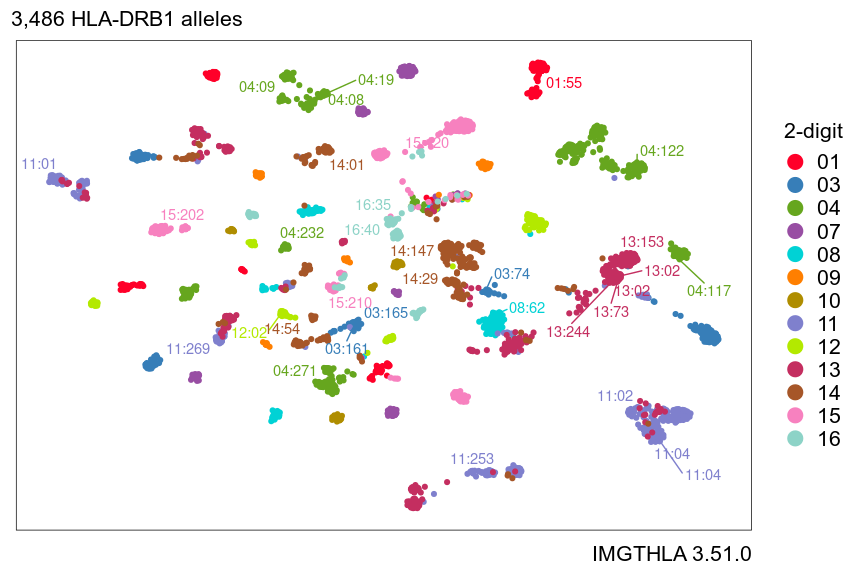
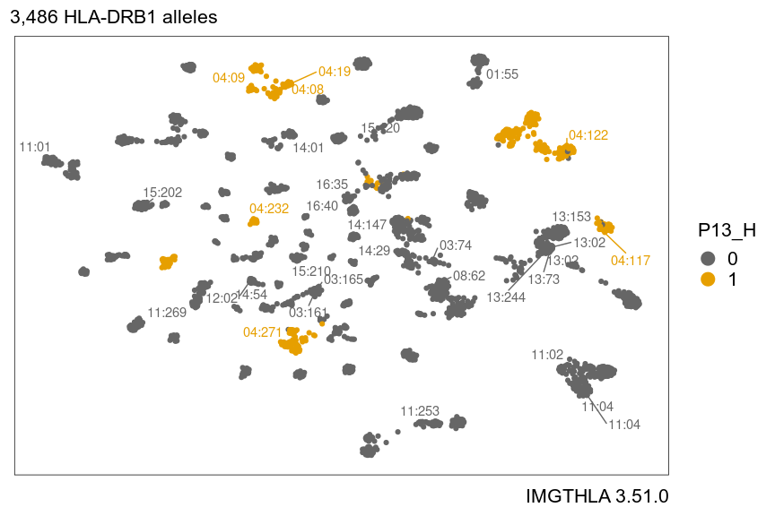

-   [Overview](#overview)
-   [Installation](#installation)
-   [Examples](#examples)
    -   [Make a one-hot encoded matrix from a set of HLA
        alleles](#make-a-one-hot-encoded-matrix-from-a-set-of-hla-alleles)
    -   [UMAP embedding of HLA-DRB1
        alleles](#umap-embedding-of-hla-drb1-alleles)
    -   [Download and unpack the latest release from
        IMGTHLA](#download-and-unpack-the-latest-release-from-imgthla)
-   [Related work](#related-work)
    -   [BIGDAWG](#bigdawg)

Overview
--------

hlabud provides functions to download and analyze human leukocyte
antigen (HLA) genotypes from [IMGTHLA](https://github.com/ANHIG/IMGTHLA)
in a tidy R workflow.

Installation
------------

The quickest way to get hlabud is to install from GitHub:

``` r
# install.packages("devtools")
devtools::install_github("slowkow/hlabud")
```

Examples
--------

### Make a one-hot encoded matrix from a set of HLA alleles

We can use `hla_alignments("DQB1")` to load the `DQB1_prot.txt` file
from the latest IMGTHLA release:

``` r
library(hlabud)
# Load the amino acid alignments for HLA-DQB1
al <- hla_alignments(gene = "DQB1", type = "prot")
```

The amino acid sequence alignments are in a data frame:

``` r
al$sequences[1:5,]
```

    ## # A tibble: 5 × 2
    ##   allele           seq                                                                              
    ##   <chr>            <chr>                                                                            
    ## 1 DQB1*05:01:01:01 MSWKKSLRIPGDLRVATVTLMLAILSSSLAEGRDSPEDFVYQFKGLCYFTNGTERVRGVTRHIYNREEYVRFDSDVGVYR…
    ## 2 DQB1*05:01:01:02 --------------------------------------------------------------------------------…
    ## 3 DQB1*05:01:01:03 --------------------------------------------------------------------------------…
    ## 4 DQB1*05:01:01:04 --------------------------------------------------------------------------------…
    ## 5 DQB1*05:01:01:05 --------------------------------------------------------------------------------…

And we get a one-hot encoded matrix with one column for each amino acid
at each position:

``` r
al$onehot[1:5,1:5]
```

    ##                  Pn32_. Pn32_M Pn31_. Pn31_S Pn31_Y
    ## DQB1*05:01:01:01      0      1      0      1      0
    ## DQB1*05:01:01:02      0      1      0      1      0
    ## DQB1*05:01:01:03      0      1      0      1      0
    ## DQB1*05:01:01:04      0      1      0      1      0
    ## DQB1*05:01:01:05      0      1      0      1      0

Now, suppose we have some individuals with the following genotypes:

``` r
genotypes <- c(
  "DQB1*02:05+DQB1*02:05+DQB1*02:05",
  "DQB1*04:72+DQB1*03:02:26",
  "DQB1*04:60+DQB1*05:70",
  "DQB1*05:01:16+DQB1*04:80"
)
```

Suppose we want to run an association test on the amino acid positions.

We can use `amino_dosage()` to convert each individual’s genotypes to
amino acid dosages:

``` r
dosage <- amino_dosage(genotypes, al$onehot)
dosage
```

    ##                                  Pn32_M P6_D P9_F P9_Y P14_L P14_M P26_G P26_L P28_S P28_T P30_Y
    ## DQB1*02:05+DQB1*02:05+DQB1*02:05      0    3    0    3     0     3     0     3     3     0     0
    ## DQB1*04:72+DQB1*03:02:26              1    2    1    1     0     2     1     1     0     2     2
    ## DQB1*04:60+DQB1*05:70                 0    2    1    1     1     1     2     0     0     2     1
    ## DQB1*05:01:16+DQB1*04:80              0    2    1    1     1     1     2     0     0     2     1
    ##                                  P38_V P61_S P61_W P75_V P138_E P138_K P206_I
    ## DQB1*02:05+DQB1*02:05+DQB1*02:05     3     0     3     3      0      0      0
    ## DQB1*04:72+DQB1*03:02:26             0     0     2     1      2      0      2
    ## DQB1*04:60+DQB1*05:70                1     1     1     2      1      0      0
    ## DQB1*05:01:16+DQB1*04:80             1     0     2     2      0      1      1

``` r
dim(dosage)
```

    ## [1]  4 18

Notice:

-   The `dosage` matrix has one row for each individual and one column
    for each amino acid at each position. By default, `amino_dosage()`
    will discard the columns where all individuals are identical.

-   The first individual has `dosage=3` for `P6_D` (position 6 Asp).
    That’s because we assigned this individual 3 alleles in our input.

Please be careful to check that your data looks the way you expect!

### UMAP embedding of HLA-DRB1 alleles

Here is an embedding of 3486 HLA-DRB1 alleles created by passing the
one-hot amino acid encoding of the alleles as the input to UMAP:



We can highlight which alleles have amino acid H at position 13:



### Download and unpack the latest release from IMGTHLA

We can download and unpack all of the data for any IMGTHLA release:

``` r
# Download all of the data (120MB) for the latest IMGTHLA release
install_hla(release = "latest")

# Or download a specific release
install_hla(release = "3.51.0")

# Where is the data being installed?
getOption("hlabud_dir")
#> [1] "/home/username/.local/share/hlabud"

# Check which release we are using
getOption("hlabud_release")
#> [1] "3.51.0"

# Use a specific release
options(hlabud_release = "3.51.0")
```

For example, here is an hlabud folder with data from 3 different
releases:

``` bash
❯ ls -lah "/home/user/.local/share/hlabud"
total 207M
drwxrwxr-x  3 user user      32 Apr  5 01:19 3.30.0
drwxrwxr-x 11 user user    4.0K Apr  7 19:31 3.40.0
drwxrwxr-x 12 user user    4.0K Apr  5 00:27 3.51.0
-rw-rw-r--  1 user user     15K Apr  7 19:23 tags.json
-rw-rw-r--  1 user user     79M Apr  7 19:28 v3.40.0-alpha.tar.gz
-rw-rw-r--  1 user user    129M Apr  4 20:07 v3.51.0-alpha.tar.gz
```

Related work
------------

### BIGDAWG

[BIGDAWG](https://CRAN.R-project.org/package=BIGDAWG) is an R package
available on CRAN that facilitates case-control analysis of HLA data.

> ‘Bridging ImmunoGenomic Data-Analysis Workflow Gaps’ (‘BIGDAWG’) is an
> integrated analysis system that automates the manual data-manipulation
> and trafficking steps (the gaps in an analysis workflow) normally
> required for analyses of highly polymorphic genetic systems (e.g., the
> immunological human leukocyte antigen (HLA) and killer-cell
> Immunoglobulin-like receptor (KIR) genes) and their respective genomic
> data (immunogenomic)
>
> Pappas DJ, Marin W, Hollenbach JA, Mack SJ. 2016. ‘Bridging
> ImmunoGenomic Data Analysis Workflow Gaps (BIGDAWG): An integrated
> case-control analysis pipeline.’ Human Immunology. 77:283-287).
>
> Starting with unambiguous genotype data for case-control groups,
> ‘BIGDAWG’ performs tests of Hardy-Weinberg equilibrium, and carries
> out case-control association analyses for haplotypes, individual loci,
> specific HLA exons, and HLA amino acid positions.
