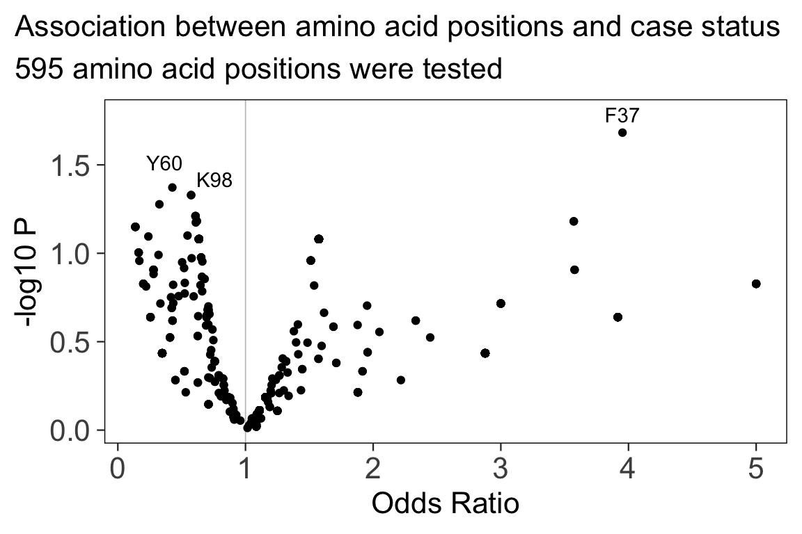

# hlabud: HLA analysis in R </img>

hlabud provides methods to retrieve sequence alignment data from [IMGTHLA] and convert the data into convenient R matrices ready for downstream analysis.
See the [usage examples](https://slowkow.github.io/hlabud/articles/examples.html) to learn how to use the data with logistic regression and dimensionality reduction.

[IMGTHLA]: https://github.com/ANHIG/IMGTHLA

For example, let’s consider a simple question about two HLA genotypes.

What amino acid positions are different between these two genotypes?

```{r example}
library(hlabud)
a <- hla_alignments("DRB1")
dosage(a$onehot, c("DRB1*03:01:05", "DRB1*03:02:03"))
```

From this output, we can conclude that four positions (26, 28, 47, 86) distinguish these two HLA-DRB1 alleles.
We see that DRB1\*03:01:05 has a F at position 26 and DRB1\*03:02:03 has a Y.


Installation
============

The quickest way to get hlabud is to install from GitHub:

```{r install, eval=FALSE}
# install.packages("devtools")
devtools::install_github("slowkow/hlabud")
```


Examples
========

See the [usage examples](articles/examples.html) to get some ideas for how to use hlabud in your analyses.

- [Get a one-hot encoded matrix for all HLA-DRB1 alleles](articles/examples.html#get-a-one-hot-encoded-matrix-for-all-hla-drb1-alleles)

- [Convert genotypes to a dosage matrix](articles/examples.html#convert-genotypes-to-a-dosage-matrix)

- [Logistic regression association for amino acid positions](articles/examples.html#logistic-regression-association-for-amino-acid-positions)

- [UMAP embedding of 3,516 HLA-DRB1 alleles](articles/examples.html#umap-embedding-of-3516-hla-drb1-alleles)

- [Get HLA allele frequencies from Allele Frequency Net Database (AFND)](articles/examples.html#get-hla-allele-frequencies-from-allele-frequency-net-database-afnd)

- [Compute HLA divergence with the Grantham distance matrix](articles/examples.html#compute-hla-divergence-with-the-grantham-distance-matrix)

- [Download and unpack all data from the latest IMGTHLA release](articles/examples.html#download-and-unpack-all-data-from-the-latest-imgthla-release)

- [Visualize the 3D molecular structure of HLA proteins and highlight specific amino acid residues](articles/visualize-hla-structure.html)

<a href="https://slowkow.github.io/hlabud/articles/examples.html#logistic-regression-association-for-amino-acid-positions">

</a>
<a href="https://slowkow.github.io/hlabud/articles/examples.html#umap-embedding-of-3516-hla-drb1-alleles">

</a>
<a href="https://slowkow.github.io/hlabud/articles/examples.html#get-hla-allele-frequencies-from-allele-frequency-net-database-afnd">

</a>
<a href="https://slowkow.github.io/hlabud/articles/visualize-hla-structure.html">

</a>


Citation
========

`hlabud` provides access to the data in IMGT/HLA database. Therefore, if you use `hlabud` then please cite the IMGT/HLA paper:

- Robinson J, Barker DJ, Georgiou X, Cooper MA, Flicek P, Marsh SGE. [IPD-IMGT/HLA Database.](https://www.ncbi.nlm.nih.gov/pubmed/31667505) Nucleic Acids Res. 2020;48: D948–D955. doi:10.1093/nar/gkz950

`hlabud` also provides access to the data in Allele Frequency Net Database (AFND). Therefore, if you use `hlabud::hla_frequencies()` then please cite the AFND paper:

- Gonzalez-Galarza FF, McCabe A, Santos EJMD, Jones J, Takeshita L, Ortega-Rivera ND, et al. [Allele frequency net database (AFND) 2020 update: gold-standard data classification, open access genotype data and new query tools.](https://pubmed.ncbi.nlm.nih.gov/31722398) Nucleic Acids Res. 2020;48: D783–D788. doi:10.1093/nar/gkz1029

Additionally, you can also cite the `hlabud` package like this:

- Slowikowski K. hlabud: methods for access and analysis of the human leukocyte antigen (HLA) gene sequence alignments from IMGT/HLA. R package version 1.0.0.


Related work
============

I recommend this article for anyone new to HLA, because the beautiful figures help to build intuition:

- La Gruta NL, Gras S, Daley SR, Thomas PG, Rossjohn J. [Understanding the drivers of MHC restriction of T cell receptors.](https://www.ncbi.nlm.nih.gov/pubmed/29636542) Nat Rev Immunol. 2018;18: 467–478.

Learn about the conventions for HLA nomenclature:

- Marsh SGE, Albert ED, Bodmer WF, Bontrop RE, Dupont B, Erlich HA, et al. [Nomenclature for factors of the HLA system, 2010.](https://www.ncbi.nlm.nih.gov/pubmed/20356336) Tissue Antigens. 2010;75: 291–455.

For case-control analysis of HLA genotype data, consider the
[BIGDAWG](https://CRAN.R-project.org/package=BIGDAWG) R package
available on CRAN. Here is the related article:

- Pappas DJ, Marin W, Hollenbach JA, Mack SJ. [Bridging ImmunoGenomic Data Analysis Workflow Gaps (BIGDAWG): An integrated case-control analysis pipeline.](https://pubmed.ncbi.nlm.nih.gov/26708359) Hum Immunol. 2016;77: 283–287.

