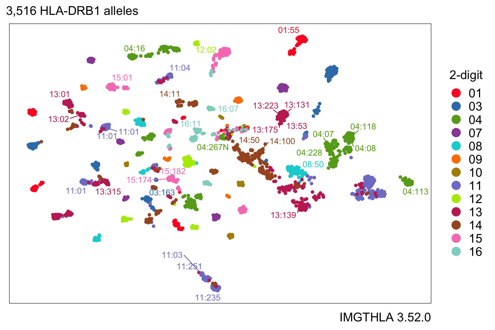

# Summary

Human leukocyte antigen (HLA) genes encode the proteins that display antigens for the immune system to recognize pathogens like bacteria and viruses.
Genes in the HLA locus on chromosome 6 in the human genome have thousands of different alleles in the human population.
The single-nucleotide polymorphisms (SNPs) encoding different amino acids in HLA genes are the genetic variants with the largest effect sizes, and they are associated with risk of developing autoimmune disease [@Kennedy2017].
The fields of immunology and genomics aim to discover molecular factors, such as HLA genotypes, that explain the functions of the human immune system in health and disease.
Analysis of this genotype data requires computational methods for managing collections of genetic data and transforming data into different encodings for downstream analyses [@Sakaue2022].

-

# Statement of need

`hlabud` is an R package that simplifies the tasks of downloading and parsing data from the IMGT/HLA database of HLA genotypes and sequence alignments [@Robinson2020].
The R programming language has a comprehensive repository of open-source libraries for statistical modeling and data visualization that can be applied to any data analysis.
The `hlabud` package provides convenient functions that return convenient lists of matrices and tables to facilitate seamless integration with any downstream R packages.
HLA genotype data is lazily downloaded (as-needed) from the IMGT-HLA GitHub repository [@imgthla] and automatically cached in a user-configurable directory.
The documentation includes usage examples for analysis of the one-hot encoding of amino acid positions such as association analysis with logistic regression and low dimensional embedding with UMAP.
`hlabud` also provides direct access to the allele frequencies for all HLA genes from Allele Frequency Net Database (AFND) [@Gonzalez-Galarza2020].

`hlabud` can be used by biomedical researchers, but it can also be used by students in courses that teach immunology, genetics, and bioinformatics.
Interested readers might also consider another R package called `BIGDAWG` that provides functions for chi-squared Hardy-Weinberg and case-control association tests of highly polymorphic genetic data like HLA genotypes [@Pappas2016].

# Acknowledgments

This work was supported by a NIAID grant T32AR007258 (to K.S.) and the National Institute of Health Director’s New Innovator Award (DP2CA247831; to A.C.V.)

# References

