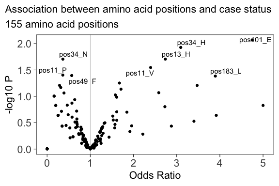
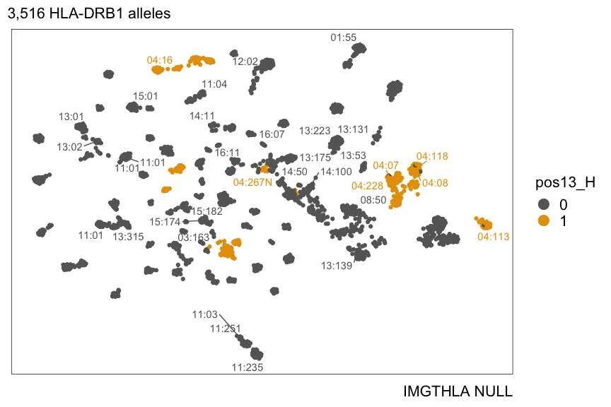
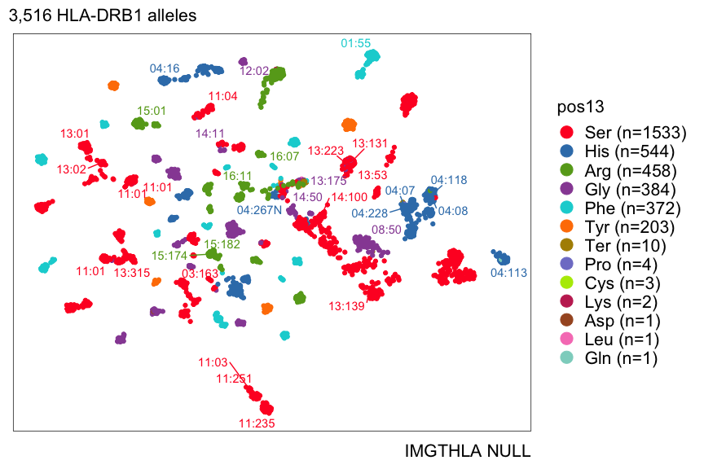
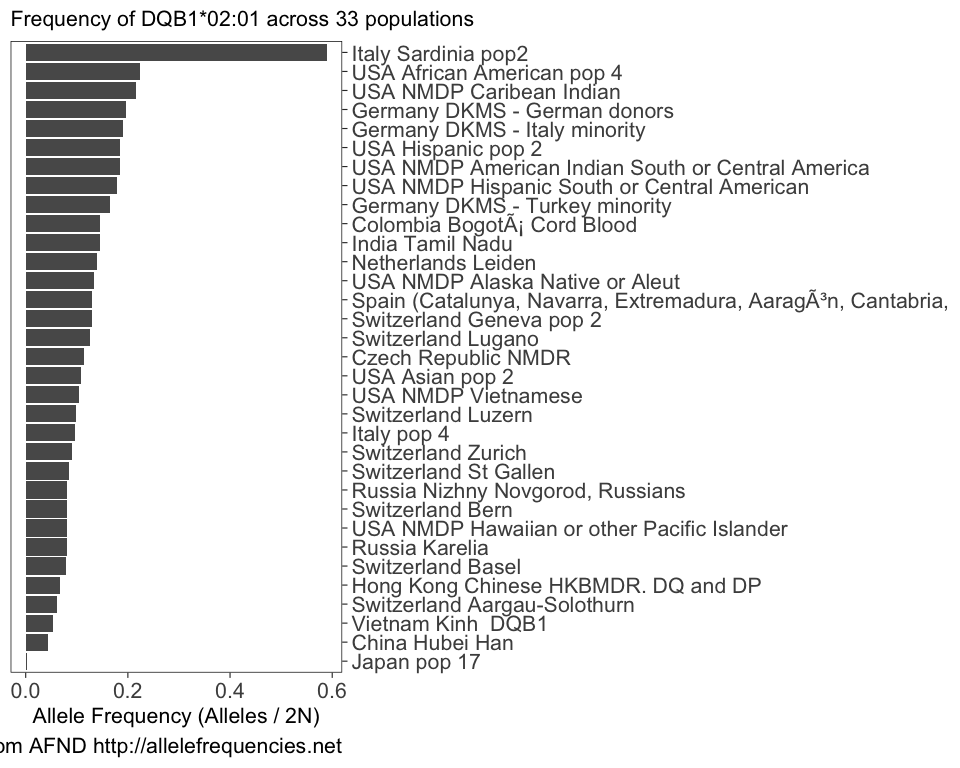
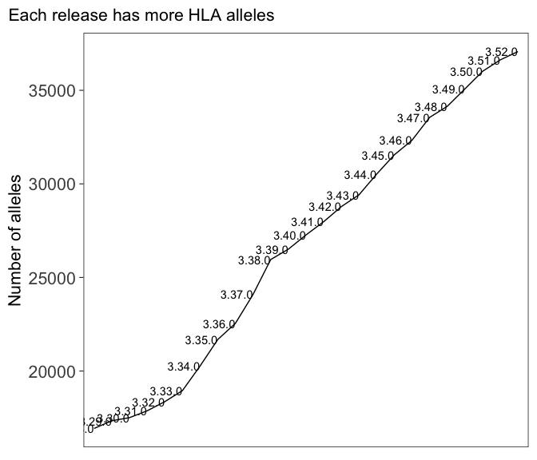
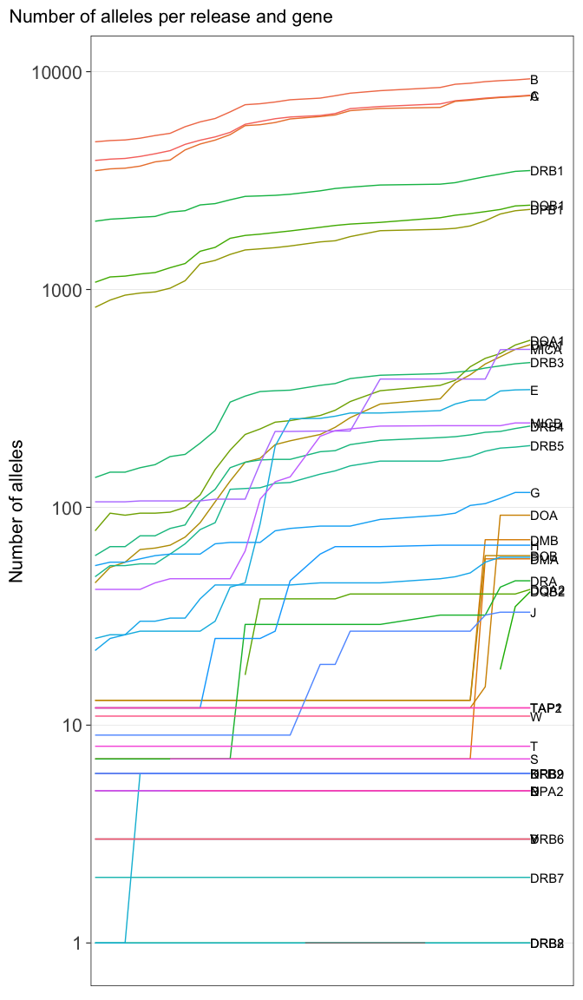

# Introduction

Kamil Slowikowski

2023-06-19

[hlabud](https://github.com/slowkow/hlabud) is an R package that
provides functions to facilitate download and analysis of human
leukocyte antigen (HLA) genotype sequence alignments from
[IMGTHLA](https://github.com/ANHIG/IMGTHLA) in R.

Let’s consider a question that we might want to answer about HLA
genotypes. What amino acid positions are different between the
DRB1\*04:174 and DRB1\*15:152 genotypes?

With hlabud, we can find the answer with a few lines of code:

    library(hlabud)
    a <- hla_alignments("DRB1")
    dosage(c("DRB1*04:174", "DRB1*15:152"), a$onehot)
    #>             pos9_E pos9_W
    #> DRB1*04:174      1      0
    #> DRB1*15:152      0      1

The two genotypes are nearly identical, but the amino acid at position 9
is different:

-   position 9 E (Glu) in DRB1\*04:174
-   position 9 W (Trp) in DRB1\*15:152

It is just as easy to find the nucleotides that distinguish the two
alleles:

    n <- hla_alignments("DRB1", type = "nuc")
    dosage(c("DRB1*04:174", "DRB1*15:152"), n$onehot)
    #>             pos22_C pos22_T
    #> DRB1*04:174       0       1
    #> DRB1*15:152       1       0

-   position 22 T in DRB1\*04:174
-   position 22 C in DRB1\*15:152

# Installation

The quickest way to get hlabud is to install from GitHub:

    # install.packages("devtools")
    devtools::install_github("slowkow/hlabud")

Below, I included a few usage examples. I hope they inspire you to share
your own HLA analyses.

The source code for this page is available
[here](https://github.com/slowkow/hlabud/tree/main/vignettes/examples.Rmd).

Thank you for [reporting
issues](https://github.com/slowkow/hlabud/issues) with hlabud.

# Get a one-hot encoded matrix for all HLA-DRB1 alleles

We can use `hla_alignments("DRB1")` to load the `DRB1_prot.txt` file
from the latest [IMGTHLA](https://github.com/ANHIG/IMGTHLA/releases)
release:

    library(hlabud)
    a <- hla_alignments(gene = "DRB1", verbose = TRUE)
    #> hlabud is using IMGTHLA release 3.52.0
    #> Reading /Users/ks38/Library/Application Support/hlabud/3.52.0/alignments/DRB1_prot.txt

The `a` object is a list with three items:

    str(a)
    #> List of 3
    #>  $ sequences: tibble [3,516 × 2] (S3: tbl_df/tbl/data.frame)
    #>   ..$ allele: chr [1:3516] "DRB1*01:01:01:01" "DRB1*01:01:01:02" "DRB1*01:01:01:03" "DRB1*01:01:01:04" ...
    #>   ..$ seq   : chr [1:3516] "MVCLKLPGGSCMTALTVTLMVLSSPLALAGDTRPRFLWQLKFECHFFNGTERVR.LLERCIYNQEE.SVRFDSDVGEYRAVTELGRPDAEYWNSQKDLLEQRRAAVDTYCR"| __truncated__ "------------------------------------------------------.-----------.--------------------------------------------"| __truncated__ "------------------------------------------------------.-----------.--------------------------------------------"| __truncated__ "------------------------------------------------------.-----------.--------------------------------------------"| __truncated__ ...
    #>  $ alleles  : chr [1:3516, 1:288] "M" "M" "M" "M" ...
    #>   ..- attr(*, "dimnames")=List of 2
    #>   .. ..$ : chr [1:3516] "DRB1*01:01:01:01" "DRB1*01:01:01:02" "DRB1*01:01:01:03" "DRB1*01:01:01:04" ...
    #>   .. ..$ : chr [1:288] "posn29" "posn28" "posn27" "posn26" ...
    #>  $ onehot   : num [1:3516, 1:1482] 1 1 1 1 1 1 1 1 1 1 ...
    #>   ..- attr(*, "dimnames")=List of 2
    #>   .. ..$ : chr [1:3516] "DRB1*01:01:01:01" "DRB1*01:01:01:02" "DRB1*01:01:01:03" "DRB1*01:01:01:04" ...
    #>   .. ..$ : chr [1:1482] "posn29_M" "posn28_L" "posn28_V" "posn27_C" ...

`a$sequences` has amino acid sequence alignments in a data frame:

    a$sequences
    #> # A tibble: 3,516 × 2
    #>    allele           seq                                                         
    #>    <chr>            <chr>                                                       
    #>  1 DRB1*01:01:01:01 MVCLKLPGGSCMTALTVTLMVLSSPLALAGDTRPRFLWQLKFECHFFNGTERVR.LLER…
    #>  2 DRB1*01:01:01:02 ------------------------------------------------------.----…
    #>  3 DRB1*01:01:01:03 ------------------------------------------------------.----…
    #>  4 DRB1*01:01:01:04 ------------------------------------------------------.----…
    #>  5 DRB1*01:01:01:05 ------------------------------------------------------.----…
    #>  6 DRB1*01:01:01:06 ------------------------------------------------------.----…
    #>  7 DRB1*01:01:01:07 ------------------------------------------------------.----…
    #>  8 DRB1*01:01:01:08 ------------------------------------------------------.----…
    #>  9 DRB1*01:01:01:09 ------------------------------------------------------.----…
    #> 10 DRB1*01:01:01:10 ------------------------------------------------------.----…
    #> # ℹ 3,506 more rows

Here are the conventions used for alignments (copied from EBI):

> -   The entry for each allele is displayed in respect to the reference
>     sequences.
> -   Where identity to the reference sequence is present the base will
>     be displayed as a hyphen (-).
> -   Non-identity to the reference sequence is shown by displaying the
>     appropriate base at that position.
> -   Where an insertion or deletion has occurred this will be
>     represented by a period (.).
> -   If the sequence is unknown at any point in the alignment, this
>     will be represented by an asterisk (\*).
> -   In protein alignments for null alleles, the ‘Stop’ codons will be
>     represented by a hash (X).
> -   In protein alignments, sequence following the termination codon,
>     will not be marked and will appear blank.
> -   These conventions are used for both nucleotide and protein
>     alignments.

Learn more about the alignments at:

-   <https://www.ebi.ac.uk/ipd/imgt/hla/alignment/help/>

`a$alleles` has a matrix of amino acids with one column for each
position:

    a$alleles[1:5,1:7]
    #>                  posn29 posn28 posn27 posn26 posn25 posn24 posn23
    #> DRB1*01:01:01:01 "M"    "V"    "C"    "L"    "K"    "L"    "P"   
    #> DRB1*01:01:01:02 "M"    "V"    "C"    "L"    "K"    "L"    "P"   
    #> DRB1*01:01:01:03 "M"    "V"    "C"    "L"    "K"    "L"    "P"   
    #> DRB1*01:01:01:04 "M"    "V"    "C"    "L"    "K"    "L"    "P"   
    #> DRB1*01:01:01:05 "M"    "V"    "C"    "L"    "K"    "L"    "P"

`a$onehot` has a one-hot encoded matrix with one column for each amino
acid at each position:

    a$onehot[1:5,1:7]
    #>                  posn29_M posn28_L posn28_V posn27_C posn26_L posn25_K posn25_R
    #> DRB1*01:01:01:01        1        0        1        1        1        1        0
    #> DRB1*01:01:01:02        1        0        1        1        1        1        0
    #> DRB1*01:01:01:03        1        0        1        1        1        1        0
    #> DRB1*01:01:01:04        1        0        1        1        1        1        0
    #> DRB1*01:01:01:05        1        0        1        1        1        1        0

# Convert genotypes to a dosage matrix

Suppose we have some individuals with the following genotypes:

    genotypes <- c(
      "DRB1*12:02:02:03,DRB1*12:02:02:03,DRB1*14:54:02",
      "DRB1*04:174,DRB1*15:152",
      "DRB1*04:56:02,DRB1*15:01:48",
      "DRB1*14:172,DRB1*04:160",
      "DRB1*04:359,DRB1*04:284:02"
    )

If we want to run an association test on the amino acid positions, then
we need to convert the genotype names to a matrix of allele dosages
(e.g., 0, 1, 2).

We can use `dosage()` to convert each individual’s genotypes to amino
acid dosages:

    dosage <- dosage(genotypes, a$onehot)
    dosage[,1:4]
    #>                                                 posn29_M pos6_R pos9_E pos9_W
    #> DRB1*12:02:02:03,DRB1*12:02:02:03,DRB1*14:54:02        2      3      3      0
    #> DRB1*04:174,DRB1*15:152                                0      2      1      1
    #> DRB1*04:56:02,DRB1*15:01:48                            0      2      1      1
    #> DRB1*14:172,DRB1*04:160                                0      2      2      0
    #> DRB1*04:359,DRB1*04:284:02                             0      2      2      0
    dim(dosage)
    #> [1]  5 35

**Note:**

-   The `dosage` matrix has one row for each individual and one column
    for each amino acid at each position. By default, `dosage()` will
    discard the columns where all individuals are identical.

-   The first individual has `dosage=3` for `pos6_R` (position 6 Arg).
    That’s because we assigned this individual 3 alleles in our input.

Please be careful to check that your data looks the way you expect!

# Logistic regression association for amino acid positions

Let’s simulate a dataset with cases and controls to demonstrate one
approach for testing which amino acid positions might be associated with
cases.

    set.seed(2)
    n <- 100
    d <- data.frame(
      geno = paste(
        sample(rownames(a$onehot), n, replace = TRUE),
        sample(rownames(a$onehot), n, replace = TRUE),
        sep = ","
      ),
      age = sample(21:100, n, replace = TRUE),
      case = sample(0:1, n, replace = TRUE)
    )
    d <- cbind(d, dosage(d$geno, a$onehot))
    d[1:5,1:6]
    #>                                                  geno age case posn29_M
    #> DRB1*04:267N,DRB1*01:02:12 DRB1*04:267N,DRB1*01:02:12  73    1        0
    #> DRB1*04:16,DRB1*15:02:06     DRB1*04:16,DRB1*15:02:06  72    0        1
    #> DRB1*14:50:02,DRB1*04:288   DRB1*14:50:02,DRB1*04:288  22    1        0
    #> DRB1*03:96,DRB1*03:106         DRB1*03:96,DRB1*03:106  34    0        0
    #> DRB1*03:72,DRB1*13:51           DRB1*03:72,DRB1*13:51  76    0        0
    #>                            posn25_K posn25_R
    #> DRB1*04:267N,DRB1*01:02:12        0        0
    #> DRB1*04:16,DRB1*15:02:06          1        0
    #> DRB1*14:50:02,DRB1*04:288         0        0
    #> DRB1*03:96,DRB1*03:106            0        0
    #> DRB1*03:72,DRB1*13:51             0        0

Our simulated dataset has 100 individuals, 52 cases and 48 controls. We
also have one column for each amino acid position that we might want to
test for association with the `case` variable.

One possible approach for association testing is to use `glm()` to fit a
logistic regression model for each amino acid position. This could
reveal if any amino acid position might be associated with the `case`
variable in our simulated dataset.

    # select the amino acid positions that have at least 3 people with dosage > 0
    my_as <- names(which(colSums(d[,4:ncol(d)] > 0) >= 3))

    # run the association tests
    my_glm <- rbindlist(pblapply(my_as, function(my_a) {
      f <- sprintf("case ~ %s", my_a)
      glm(as.formula(f), data = d, family = "binomial") %>%
        parameters(exponentiate = TRUE)
    }))

    # look at the top hits
    my_glm %>%
      arrange(p) %>%
      filter(!Parameter %in% c("(Intercept)")) %>%
      head
    #>    Parameter Coefficient        SE   CI    CI_low    CI_high         z df_error
    #> 1:  pos101_E   4.7492150 2.8141197 0.95 1.6324022 17.5185505  2.629305      Inf
    #> 2:   pos34_H   3.0945832 1.3884885 0.95 1.3489859  7.9635257  2.517706      Inf
    #> 3:   pos13_H   2.7384213 1.1831088 0.95 1.2237664  6.7577338  2.331683      Inf
    #> 4:   pos34_N   0.3651739 0.1577699 0.95 0.1479786  0.8171494 -2.331683      Inf
    #> 5:   pos11_V   2.3962994 0.9557534 0.95 1.1336182  5.4854153  2.191138      Inf
    #> 6:   pos11_P   0.3636364 0.1786921 0.95 0.1329654  0.9307394 -2.058596      Inf
    #>              p
    #> 1: 0.008555961
    #> 2: 0.011812185
    #> 3: 0.019717351
    #> 4: 0.019717351
    #> 5: 0.028441812
    #> 6: 0.039532948

The volcano below shows the Odds Ratio and P-value for each amino acid
position. The top hits with P &lt; 0.05 are labeled.

In this simulation, the `case` variable is associated with pos101\_E (P
= 0.0086, OR = 4.7, 95% CI 1.6 to 18).

# UMAP embedding of 3,516 HLA-DRB1 alleles

There are many possibilities for analysis of a one-hot encoding of
HLA-DRB1 alleles.

For example, here is a UMAP embedding of 3,516 HLA-DRB1 alleles encoded
as a one-hot amino acid matrix with 1482 columns, one for each amino
acid at each position.

    uamp(a$onehot, n_epochs = 200, min_dist = 1, spread = 2)

We can highlight which alleles have amino acid H at position 13:

Or we can represent each amino acid at position 13 with a different
color:

# Get HLA allele frequencies from Allele Frequency Net Database (AFND)

Download and read a table of HLA allele frequencies from the [Allele
Frequency Net Database (AFND)](http://www.allelefrequencies.net/).

If you use this data, please cite the latest manuscript about Allele
Frequency Net Database:

-   Gonzalez-Galarza FF, McCabe A, Santos EJMD, Jones J, Takeshita L,
    Ortega-Rivera ND, et al. [Allele frequency net database (AFND) 2020
    update: gold-standard data classification, open access genotype data
    and new query tools.](https://pubmed.ncbi.nlm.nih.gov/31722398)
    Nucleic Acids Res. 2020;48: D783–D788. <doi:10.1093/nar/gkz1029>

<!-- -->

    af <- hla_frequencies()
    af
    #> # A tibble: 123,502 × 7
    #>    group gene  allele  population            indivs_over_n alleles_over_2n     n
    #>    <chr> <chr> <chr>   <chr>                         <dbl>           <dbl> <dbl>
    #>  1 hla   A     A*01:01 Argentina Rosario To…          15.1           0.076    86
    #>  2 hla   A     A*01:01 Armenia combined Reg…          NA             0.125   100
    #>  3 hla   A     A*01:01 Australia Cape York …          NA             0.053   103
    #>  4 hla   A     A*01:01 Australia Groote Eyl…          NA             0.027    75
    #>  5 hla   A     A*01:01 Australia New South …          NA             0.187   134
    #>  6 hla   A     A*01:01 Australia Yuendumu A…          NA             0.008   191
    #>  7 hla   A     A*01:01 Austria                        27             0.146   200
    #>  8 hla   A     A*01:01 Azores Central Islan…          NA             0.08     59
    #>  9 hla   A     A*01:01 Azores Oriental Isla…          NA             0.115    43
    #> 10 hla   A     A*01:01 Azores Terceira Isla…          NA             0.109   130
    #> # ℹ 123,492 more rows

Plot the frequency of a specific allele (DQB1\*02:01) in populations
with more than 1000 sampled individuals:

    my_allele <- "DQB1*02:01"
    my_af <- af %>% filter(allele == my_allele) %>%
      filter(n > 1000) %>%
      arrange(-alleles_over_2n)

    ggplot(my_af) +
      aes(x = alleles_over_2n, y = reorder(population, alleles_over_2n)) +
      scale_y_discrete(position = "right") +
      geom_colh() +
      labs(
        x = "Allele Frequency (Alleles / 2N)",
        y = NULL,
        title =  glue("Frequency of {my_allele} across {length(unique(my_af$population))} populations"),
        caption = "Data from AFND http://allelefrequencies.net"
      )

See
[github.com/slowkow/allelefrequencies](https://github.com/slowkow/allelefrequencies)
for more examples of how we might use this data.

# Download and unpack all data from the latest IMGTHLA release

If you only want to use `hla_alignments()`, then you don’t need
`install_hla()` because data files are downloaded automatically as
needed and cached for future use.

But some users might need access to additional files that are only
present in the full data release.

Run `install_hla()` to download and unpack the [latest IMGTHLA
release](https://github.com/ANHIG/IMGTHLA/releases). The destination
folder for the downloaded data files is `getOption("hlabud_dir")`
(automatically tailored to your operating system thanks to the
[rappdirs](https://github.com/r-lib/rappdirs) package).

Here are a few examples of how to download releases or get a list of
release names.

Download the latest release (default) or a specific release:

    # Download all of the data (120MB) for the latest IMGTHLA release
    install_hla(release = "latest")

    # Download a specific release
    install_hla(release = "3.51.0")

Optionally, get or set the directory hlabud uses to store the data:

    getOption("hlabud_dir")
    #> [1] "/home/username/.local/share/hlabud"

    # Manually override the directory for hlabud to use
    options(hlabud_dir = "/path/to/my/dir")

List all releases:

    hla_releases()
    #>  [1] "3.51.0"   "3.50.0"   "3.49.0"   "3.48.0"   "3.47.0"   "3.46.0"   "3.45.1"   "3.45.01"
    #>  [9] "3.45.0.1" "3.45.0"   "3.44.1"   "3.44.0"   "3.43.0"   "3.42.0"   "3.41.2"   "3.41.0"
    #> [17] "3.40.0"   "3.39.0"   "3.38.0"   "3.37.0"   "3.36.0"   "3.35.0"   "3.34.0"   "3.33.0"
    #> [25] "3.32.0"   "3.31.0"   "3.30.0"   "3.29.0"   "3.28.0"   "3.27.0"

After installing a few releases, the hlabud folder might look like this:

    ❯ ls -lah "/home/user/.local/share/hlabud"
    total 207M
    drwxrwxr-x  3 user user      32 Apr  5 01:19 3.30.0
    drwxrwxr-x 11 user user    4.0K Apr  7 19:31 3.40.0
    drwxrwxr-x 12 user user    4.0K Apr  5 00:27 3.51.0
    -rw-rw-r--  1 user user     15K Apr  7 19:23 tags.json
    -rw-rw-r--  1 user user     79M Apr  7 19:28 v3.40.0-alpha.tar.gz
    -rw-rw-r--  1 user user    129M Apr  4 20:07 v3.51.0-alpha.tar.gz

# Count the number of alleles in each IMGTHLA release

We can get a list of the release names:

    releases <- hla_releases()
    releases
    #>  [1] "3.52.0"   "3.51.0"   "3.50.0"   "3.49.0"   "3.48.0"   "3.47.0"  
    #>  [7] "3.46.0"   "3.45.1"   "3.45.01"  "3.45.0.1" "3.45.0"   "3.44.1"  
    #> [13] "3.44.0"   "3.43.0"   "3.42.0"   "3.41.2"   "3.41.0"   "3.40.0"  
    #> [19] "3.39.0"   "3.38.0"   "3.37.0"   "3.36.0"   "3.35.0"   "3.34.0"  
    #> [25] "3.33.0"   "3.32.0"   "3.31.0"   "3.30.0"   "3.29.0"   "3.28.0"

Then we can get the allele names for each release:

    my_alleles <- rbindlist(lapply(releases, function(release) {
      retval <- hla_alleles(release = release)
      retval$release <- release
      return(retval)
    }), fill = TRUE)
    #> Warning in hla_alleles(release = release): unrecognized release name
    #> 'Allelelist.3451.txt'
    #> Warning in hla_alleles(release = release): unrecognized release name
    #> 'Allelelist.34501.txt'

    #> Warning in hla_alleles(release = release): unrecognized release name
    #> 'Allelelist.34501.txt'
    #> Warning in hla_alleles(release = release): unrecognized release name
    #> 'Allelelist.3441.txt'
    #> Warning in hla_alleles(release = release): unrecognized release name
    #> 'Allelelist.3412.txt'

Next, count how many alleles we have in each release:

    d <- my_alleles %>% count(release) %>% filter(n > 1)
    d
    #>     release     n
    #>  1:  3.28.0 16933
    #>  2:  3.29.0 17344
    #>  3:  3.30.0 17509
    #>  4:  3.31.0 17874
    #>  5:  3.32.0 18363
    #>  6:  3.33.0 18955
    #>  7:  3.34.0 20272
    #>  8:  3.35.0 21683
    #>  9:  3.36.0 22548
    #> 10:  3.37.0 24093
    #> 11:  3.38.0 25958
    #> 12:  3.39.0 26512
    #> 13:  3.40.0 27273
    #> 14:  3.41.0 27980
    #> 15:  3.42.0 28786
    #> 16:  3.43.0 29417
    #> 17:  3.44.0 30523
    #> 18:  3.45.0 31552
    #> 19:  3.46.0 32330
    #> 20:  3.47.0 33552
    #> 21:  3.48.0 34145
    #> 22:  3.49.0 35077
    #> 23:  3.50.0 36016
    #> 24:  3.51.0 36625
    #> 25:  3.52.0 37068
    #>     release     n

And plot the number of alleles as a line plot:

    ggplot(d) +
      aes(x = release, y = n, group = 1) +
      geom_line() +
      geom_text(aes(label = release), hjust = 1) +
      labs(x = NULL, y = "Number of alleles",
      title = "Each release has more HLA alleles") +
      theme(
        axis.text.x = element_blank(),
        axis.ticks.x = element_blank(),
      )

    d2 <- my_alleles %>% mutate(gene = str_split_fixed(Allele, "\\*", 2)[,1]) %>% count(release, gene)
    ggplot() +
      aes(x = release, y = n) +
      geom_line(
        data = d2,
        aes(group = gene, color = gene)
      ) +
      scale_color_discrete(guide = "none") +
      geom_text(
        data = d2 %>% filter(release == "3.52.0"),
        mapping = aes(label = gene),
        hjust = 0
      ) +
      labs(x = NULL, y = "Number of alleles",
      title = "Number of alleles per release and gene") +
      scale_x_discrete(expand = expansion(mult = c(0.01, 0.1))) +
      scale_y_log10() +
      theme(
        panel.grid.major.y = element_line(), 
        axis.text.x = element_blank(),
        axis.ticks.x = element_blank(),
      )

