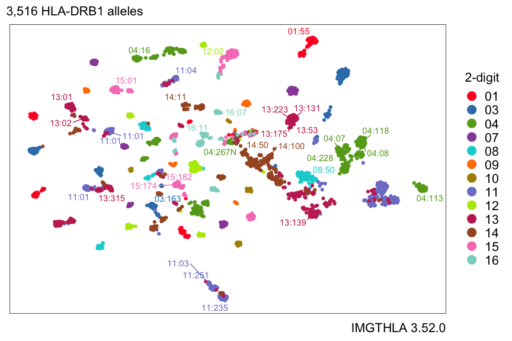
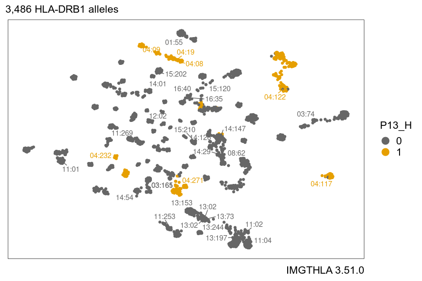
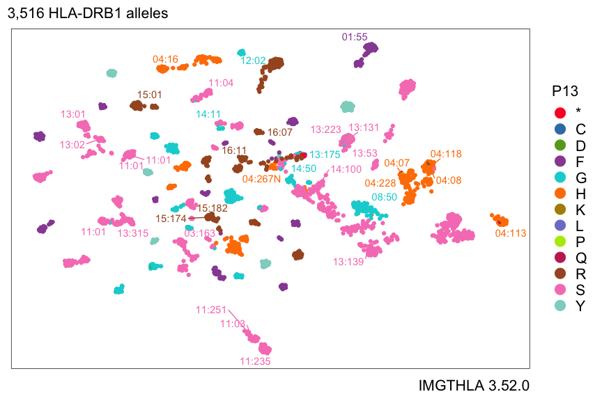

# Introduction

Kamil Slowikowski

2023-04-12

[hlabud] is an R package that provides functions to download and analyze human leukocyte antigen (HLA) genotypes from [IMGTHLA] in a tidy R workflow.

[hlabud]: https://github.com/slowkow/hlabud
[IMGTHLA]: https://github.com/ANHIG/IMGTHLA

For example, what amino acid positions are different between the DRB1\*04:174 and DRB1\*15:152 genotypes?


```r
library(hlabud)
a <- hla_alignments("DRB1")
amino_dosage(c("DRB1*04:174", "DRB1*15:152"), a$onehot)
#>             P9_E P9_W
#> DRB1*04:174    1    0
#> DRB1*15:152    0    1
```

The two genotypes are nearly identical, but the amino acid at position 9 is different:

- E (Glu) in DRB1\*04:174
- W (Trp) in DRB1\*15:152


# Installation

The quickest way to get hlabud is to install from GitHub:


```r
# install.packages("devtools")
devtools::install_github("slowkow/hlabud")
```

Below, I included a few usage examples. I hope they inspire you to share your own HLA analyses.

The source code for this page is available [here](https://github.com/slowkow/hlabud/tree/main/vignettes/examples.Rmd).

Thank you for [reporting issues](https://github.com/slowkow/hlabud/issues) with hlabud.


# Examples

## Get a one-hot encoded matrix for all HLA-DRB1 alleles

We can use `hla_alignments("DRB1")` to load the `DRB1_prot.txt` file from the
latest [IMGTHLA](https://github.com/ANHIG/IMGTHLA/releases) release:


```r
library(hlabud)
a <- hla_alignments(gene = "DRB1", quiet = FALSE)
#> hlabud is using IMGTHLA release 3.51.0
#> Reading /projects/home/ks38/.local/share/hlabud/3.51.0/alignments/DRB1_prot.txt
```

The `a` object is a list with three items:


```r
str(a, max.level = 1)
#> List of 3
#>  $ sequences:'data.frame':	3486 obs. of  2 variables:
#>  $ aminos   :'data.frame':	3486 obs. of  288 variables:
#>  $ onehot   : num [1:3486, 1:1334] 1 1 1 1 1 1 1 1 1 1 ...
#>   ..- attr(*, "dimnames")=List of 2
```

`a$sequences` has amino acid sequence alignments in a data frame:


```r
a$sequences[1:5,]
#>             allele
#> 1 DRB1*01:01:01:01
#> 2 DRB1*01:01:01:02
#> 3 DRB1*01:01:01:03
#> 4 DRB1*01:01:01:04
#> 5 DRB1*01:01:01:05
#>                                                                                                                                                                                                                                                                             seq
#> 1 MVCLKLPGGSCMTALTVTLMVLSSPLALAGDTRPRFLWQLKFECHFFNGTERVR.LLERCIYNQEE.SVRFDSDVGEYRAVTELGRPDAEYWNSQKDLLEQRRAAVDTYCRHNYGVGESFTVQRR.VEPKVTVYPSKTQPLQHHNLLVCSVSGFYPGSIEVRWFRNGQEEKAGVVSTGLIQNGDWTFQTLVMLETVPRSGEVYTCQVEHPSVTSPLTVEWRARSESAQSKMLSGVGGFVLGLLFLGAGLFIYFRNQKGHSGLQPTGFLS
#> 2 ------------------------------------------------------.-----------.----------------------------------------------------------.-----------------------------------------------------------------------------------------------------------------------------------------------
#> 3 ------------------------------------------------------.-----------.----------------------------------------------------------.-----------------------------------------------------------------------------------------------------------------------------------------------
#> 4 ------------------------------------------------------.-----------.----------------------------------------------------------.-----------------------------------------------------------------------------------------------------------------------------------------------
#> 5 ------------------------------------------------------.-----------.----------------------------------------------------------.-----------------------------------------------------------------------------------------------------------------------------------------------
```

Here are the conventions used for alignments (copied from EBI):

> * The entry for each allele is displayed in respect to the reference sequences.
> * Where identity to the reference sequence is present the base will be displayed as a hyphen (-).
> * Non-identity to the reference sequence is shown by displaying the appropriate base at that position.
> * Where an insertion or deletion has occurred this will be represented by a period (.).
> * If the sequence is unknown at any point in the alignment, this will be represented by an asterisk (*).
> * In protein alignments for null alleles, the 'Stop' codons will be represented by a hash (X).
> * In protein alignments, sequence following the termination codon, will not be marked and will appear blank.
> * These conventions are used for both nucleotide and protein alignments.

Learn more about the alignments at: 

* https://www.ebi.ac.uk/ipd/imgt/hla/alignment/help/

`a$aminos` has a matrix of amino acids with one column for each position:


```r
a$aminos[1:5,1:10]
#>                  Pn29 Pn28 Pn27 Pn26 Pn25 Pn24 Pn23 Pn22 Pn21 Pn20
#> DRB1*01:01:01:01    M    V    C    L    K    L    P    G    G    S
#> DRB1*01:01:01:02    M    V    C    L    K    L    P    G    G    S
#> DRB1*01:01:01:03    M    V    C    L    K    L    P    G    G    S
#> DRB1*01:01:01:04    M    V    C    L    K    L    P    G    G    S
#> DRB1*01:01:01:05    M    V    C    L    K    L    P    G    G    S
```

`a$onehot` has a one-hot encoded matrix with one column for each amino acid at
each position:


```r
a$onehot[1:5,1:8]
#>                  Pn29_M Pn28_V Pn27_C Pn26_L Pn25_K Pn25_R Pn24_F Pn24_L
#> DRB1*01:01:01:01      1      1      1      1      1      0      0      1
#> DRB1*01:01:01:02      1      1      1      1      1      0      0      1
#> DRB1*01:01:01:03      1      1      1      1      1      0      0      1
#> DRB1*01:01:01:04      1      1      1      1      1      0      0      1
#> DRB1*01:01:01:05      1      1      1      1      1      0      0      1
```

## Convert genotypes to a dosage matrix

Suppose we have some individuals with the following genotypes:


```r
genotypes <- c(
  "DRB1*12:02:02:03,DRB1*12:02:02:03,DRB1*14:54:02",
  "DRB1*04:174,DRB1*15:152",
  "DRB1*04:56:02,DRB1*15:01:48",
  "DRB1*14:172,DRB1*04:160",
  "DRB1*04:359,DRB1*04:284:02"
)
```

If we want to run an association test on the amino acid positions, then we need
to convert the genotype names to a matrix of allele dosages (e.g., 0, 1, 2).

We can use `amino_dosage()` to convert each individual's genotypes to amino
acid dosages:


```r
dosage <- amino_dosage(genotypes, a$onehot)
dosage[,1:6]
#>                                                 Pn29_M P6_R P9_E P9_W P10_Q
#> DRB1*12:02:02:03,DRB1*12:02:02:03,DRB1*14:54:02      2    3    3    0     0
#> DRB1*04:174,DRB1*15:152                              0    2    1    1     2
#> DRB1*04:56:02,DRB1*15:01:48                          0    2    1    1     2
#> DRB1*14:172,DRB1*04:160                              0    2    2    0     1
#> DRB1*04:359,DRB1*04:284:02                           0    2    2    0     2
#>                                                 P10_Y
#> DRB1*12:02:02:03,DRB1*12:02:02:03,DRB1*14:54:02     3
#> DRB1*04:174,DRB1*15:152                             0
#> DRB1*04:56:02,DRB1*15:01:48                         0
#> DRB1*14:172,DRB1*04:160                             1
#> DRB1*04:359,DRB1*04:284:02                          0
dim(dosage)
#> [1]  5 35
```

**Note:**

* The `dosage` matrix has one row for each individual and one column for each
  amino acid at each position. By default, `amino_dosage()` will discard the
  columns where all individuals are identical.

* The first individual has `dosage=3` for `P6_R` (position 6 Arg). That's
  because we assigned this individual 3 alleles in our input.

Please be careful to check that your data looks the way you expect!

## Logistic regression association for amino acid positions

Let's simulate a dataset with cases and controls to demonstrate one approach
for testing which amino acid positions might be associated with cases.


```r
set.seed(2)
n <- 100
d <- data.frame(
  geno = paste(
    sample(rownames(a$onehot), n, replace = TRUE),
    sample(rownames(a$onehot), n, replace = TRUE),
    sep = ","
  ),
  age = sample(21:100, n, replace = TRUE),
  case = sample(0:1, n, replace = TRUE)
)
d <- cbind(d, amino_dosage(d$geno, a$onehot))
d[1:5,1:6]
#>                                                geno age case Pn29_M Pn25_K
#> DRB1*04:271,DRB1*01:02:12 DRB1*04:271,DRB1*01:02:12  72    0      0      0
#> DRB1*04:19,DRB1*15:07:01   DRB1*04:19,DRB1*15:07:01  22    1      2      2
#> DRB1*14:54:08,DRB1*04:292 DRB1*14:54:08,DRB1*04:292  34    0      0      0
#> DRB1*03:98,DRB1*03:108       DRB1*03:98,DRB1*03:108  76    0      0      0
#> DRB1*03:74,DRB1*13:71         DRB1*03:74,DRB1*13:71  96    1      0      0
#>                           Pn25_R
#> DRB1*04:271,DRB1*01:02:12      0
#> DRB1*04:19,DRB1*15:07:01       0
#> DRB1*14:54:08,DRB1*04:292      0
#> DRB1*03:98,DRB1*03:108         0
#> DRB1*03:74,DRB1*13:71          0
```

Our simulated dataset has 100 individuals, 52 cases and 48 controls. We also have one column for each amino acid position that we might want to test for association with the `case` variable.

One possible approach for association testing is to use `glm()` to fit a
logistic regression model for each amino acid position. This could reveal if
any amino acid position might be associated with the `case` variable in our
simulated dataset.


```r

# select the amino acid positions that have at least 3 people with dosage > 0
my_as <- names(which(colSums(d[,4:ncol(d)] > 0) >= 3))

# run the association tests
my_glm <- rbindlist(pblapply(my_as, function(my_a) {
  f <- sprintf("case ~ %s", my_a)
  glm(as.formula(f), data = d, family = "binomial") %>%
    parameters(exponentiate = TRUE)
}))

# look at the top hits
my_glm %>%
  arrange(p) %>%
  filter(!Parameter %in% c("(Intercept)")) %>%
  head
#>    Parameter Coefficient        SE   CI    CI_low    CI_high         z df_error          p
#> 1:     P62_Y   0.3941101 0.1616955 0.95 0.1689189  0.8533865 -2.269486      Inf 0.02323880
#> 2:     P13_G   4.0243902 2.7614898 0.95 1.1612170 18.7172101  2.029142      Inf 0.04244386
#> 3:     P49_Y   1.8181911 0.5670185 0.95 0.9999588  3.4287965  1.917030      Inf 0.05523418
#> 4:     P72_R   2.3127447 1.0221532 0.95 1.0163649  5.8789932  1.897060      Inf 0.05782000
#> 5:     P76_A   0.5331945 0.1773077 0.95 0.2713305  1.0083553 -1.891117      Inf 0.05860878
#> 6:     P16_H   0.3488372 0.1991184 0.95 0.1040766  1.0169353 -1.845022      Inf 0.06503428
```

The volcano below shows the Odds Ratio and P-value for each amino acid
position. The top hits with P &lt; 0.05 are labeled.

<!-- -->

In this simulation, the `case` variable is associated with P62_Y (P = 0.023, OR = 0.39, 95% CI 0.17 to 0.85).


## UMAP embedding of 3,486 HLA-DRB1 alleles

There are many things we might do with a one-hot encoding of HLA-DRB1 alleles.

For example, here is a UMAP embedding of 3,486 HLA-DRB1 alleles encoded as a one-hot amino acid matrix with 1334 columns, one for each amino acid at each position.


```r
uamp(a$onehot, n_epochs = 200, min_dist = 1, spread = 2)
```

<!-- -->

We can highlight which alleles have amino acid H at position 13:

<!-- -->

Or we can represent each amino acid at position 13 with a different color:

<!-- -->

## Download and unpack all data from the latest IMGTHLA release

If you only want to use `hla_alignments()`, then you don't need `install_hla()` because data files are automatically downloaded automatically as needed.

But some users might need access to additional files that are only present in the full data release.

Run `install_hla()` to download and unpack the [latest IMGTHLA release](https://github.com/ANHIG/IMGTHLA/releases).
The destination folder for the downloaded data files is `getOption("hlabud_dir")` (automatically tailored to your operating system thanks to the [rappdirs](https://github.com/r-lib/rappdirs) package).

Here are a few examples of how to download releases or get a list of release names.

Download the latest release (default) or a specific release:


```r
# Download all of the data (120MB) for the latest IMGTHLA release
install_hla(release = "latest")

# Download a specific release
install_hla(release = "3.51.0")
```

Optionally, get or set the directory hlabud uses to store the data:


```r
getOption("hlabud_dir")
#> [1] "/home/username/.local/share/hlabud"

# Manually override the directory for hlabud to use
options(hlabud_dir = "/path/to/my/dir")
```

Check which release hlabud is using, or choose a release:


```r
getOption("hlabud_release")
#> [1] "3.51.0"

# Use a specific release
options(hlabud_release = "3.51.0")

# List all releases
hla_releases()
#>  [1] "3.51.0"   "3.50.0"   "3.49.0"   "3.48.0"   "3.47.0"   "3.46.0"   "3.45.1"   "3.45.01"
#>  [9] "3.45.0.1" "3.45.0"   "3.44.1"   "3.44.0"   "3.43.0"   "3.42.0"   "3.41.2"   "3.41.0"
#> [17] "3.40.0"   "3.39.0"   "3.38.0"   "3.37.0"   "3.36.0"   "3.35.0"   "3.34.0"   "3.33.0"
#> [25] "3.32.0"   "3.31.0"   "3.30.0"   "3.29.0"   "3.28.0"   "3.27.0"
```

After installing a few releases, the hlabud folder might look like this:

```bash
❯ ls -lah "/home/user/.local/share/hlabud"
total 207M
drwxrwxr-x  3 user user      32 Apr  5 01:19 3.30.0
drwxrwxr-x 11 user user    4.0K Apr  7 19:31 3.40.0
drwxrwxr-x 12 user user    4.0K Apr  5 00:27 3.51.0
-rw-rw-r--  1 user user     15K Apr  7 19:23 tags.json
-rw-rw-r--  1 user user     79M Apr  7 19:28 v3.40.0-alpha.tar.gz
-rw-rw-r--  1 user user    129M Apr  4 20:07 v3.51.0-alpha.tar.gz
```

