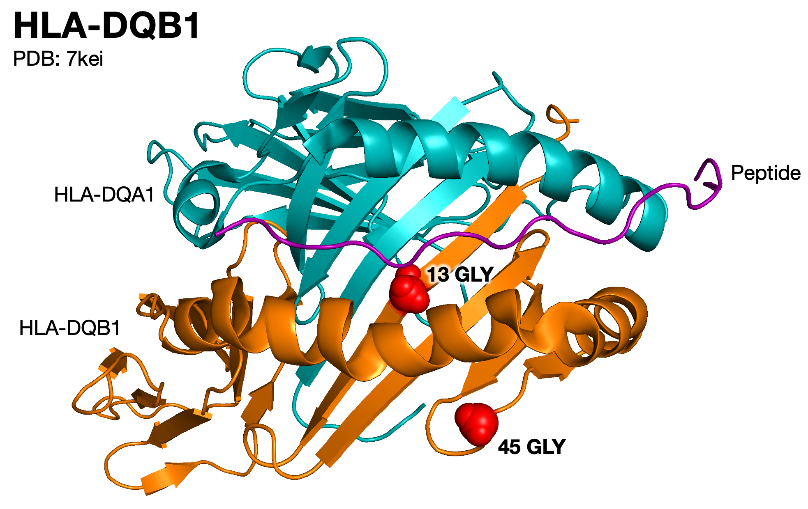

```{r setup, include=FALSE}
knitr::opts_chunk$set(
  collapse = TRUE,
  comment = "#>"
)
```

# Introduction

Kamil Slowikowski

`r Sys.Date()`

In this vignette, we explore a few different methods for visualizing the molecular structure of HLA proteins.
First, we'll look at an example of how to use the [NGLVieweR] R package to show HLA protein structures.
Next, we'll use [PyMOL] to do the same thing.

# What are the PDB identifiers for each HLA gene?

Here is a list of PDB identifiers you might consider using to represent each HLA protein:

```
HLA-A  2xpg
HLA-B  2bvp
HLA-C  4nt6
HLA-DP 3lqz
HLA-DQ 4z7w
HLA-DR 3pdo
```

Also try searching the PDB website for, e.g., `"HLA-DR"` and see if there is a more appropriate structure for your analysis.

# NGLVieweR

Let's try to visualize position 9 in the HLA-B protein structure.

We will visualize the structure of [2bvp] from the Protein Data Bank (PDB).

Here is an example of how to do this with the [NGLVieweR] R package by [Niels van der Velden]:

[2bvp]: https://www.rcsb.org/structure/2BVP
[NGLVieweR]: https://github.com/nvelden/NGLVieweR
[Niels van der Velden]: https://www.nielsvandervelden.com/

```{r, nglviewer-2bvp}
library(NGLVieweR)
library(magrittr)
my_sele <- "9:A"
NGLVieweR("2bvp") %>%
  stageParameters(
    backgroundColor = "white",
    zoomSpeed = 1,
    cameraFov = 60
  ) %>%
  addRepresentation(
    type = "cartoon"
  ) %>%
  addRepresentation(
    type = "ball+stick",
    param = list(
      sele = my_sele
    )
  ) %>%
  addRepresentation(
    type = "label",
    param = list(
      sele = my_sele,
      labelType = "format",
      labelFormat = "[%(resname)s]%(resno)s", # or enter custom text
      labelGrouping = "residue", # or "atom" (eg. sele = "20:A.CB")
      color = "black",
      fontFamiliy = "sans-serif",
      xOffset = 1,
      yOffset = 0,
      zOffset = 0,
      fixedSize = TRUE,
      radiusType = 1,
      radiusSize = 5.5, # Label size
      showBackground = TRUE
      # backgroundColor="black",
      # backgroundOpacity=0.5
    )
  ) %>%
  zoomMove(
    center = my_sele,
    zoom = my_sele,
    duration = 0, # animation time in ms
    z_offSet = -20
  ) %>%
  setSpin()
```

In the view above, we see the blue peptide and the red HLA-B protein.
The tyrosine at position 9 is highlighted with a `ball+stick` representation, and it is also labeled with a text label.
The structure is slowly spinning, so we can get a better look at it from all angles.

Also, try using the mouse to drag the structure and rotate it manually!

We can use hlabud to answer some questions about HLA-B Tyr9 (tyrosine at position 9).

For example, which HLA-B alleles have this amino acid position?

```{r, B-Tyr9}
library(hlabud)
a <- hla_alignments("B")
head(names(which(a$onehot[,"pos9_Y"] == 1)))
```

What fraction of reported HLA-B alleles have Tyr9?

```{r, B-Tyr9-sum}
sum(a$onehot[,"pos9_Y"] == 1) / nrow(a$onehot)
```

# PyMOL

Here is a bash script we can use to:

1. Write a PyMOL script
2. Run the script with the `pymol` command

```{bash, eval=FALSE}
#!/usr/bin/env bash

# Write a pymol script
cat << EOF > script.pml
fetch 7kei
show cartoon
color teal, chain A
color orange, chain B
color purple, chain C
color red, chain B & resi 13
color red, chain B & resi 45
label n. CA and chain B & resi 13, "%s %s" % (resi, resn)
label n. CA and chain B & resi 45, "%s %s" % (resi, resn)
png 7kei.png, width=1200, height=800, dpi=300 
EOF

# On Linux, we can just use `pymol` without making an alias

# On macOS, we need to make an alias
alias pymol=/Applications/PyMOL.app/Contents/MacOS/PyMOL

pymol -c script.pml
```

</img>

I manually edited the PNG file with Powerpoint to add more text labels like `"PDB: 7kei"`.

Consider spinning the structure manually with your mouse before saving the png file.


# nglview

```{python nglview, eval=FALSE}
import nglview
import time
view = nglview.show_pdbid("2bvp")
view.add_cartoon()
view.add_representation('ball+stick', selection='9:A')
im = view.render_image()
while not im.value:
  time.sleep(0.1)
with open(f'2bvp_pos9.png', 'wb') as fh:
  fh.write(im.value)
```


# Related work

- https://github.com/biasmv/pv

